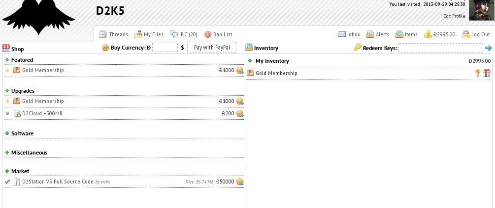
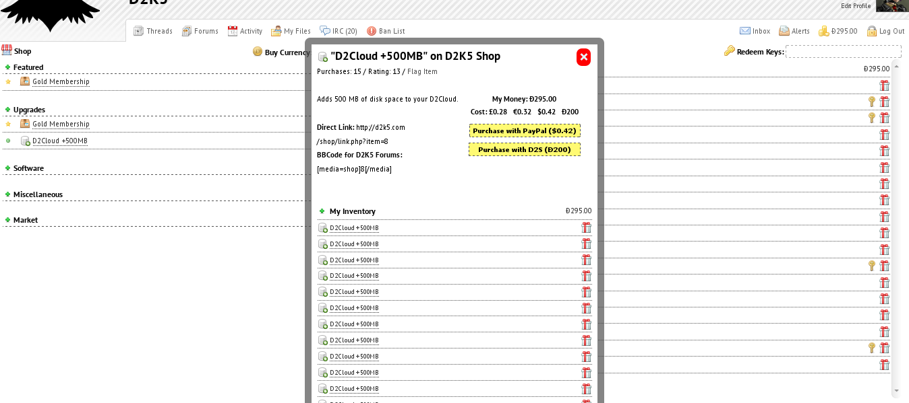
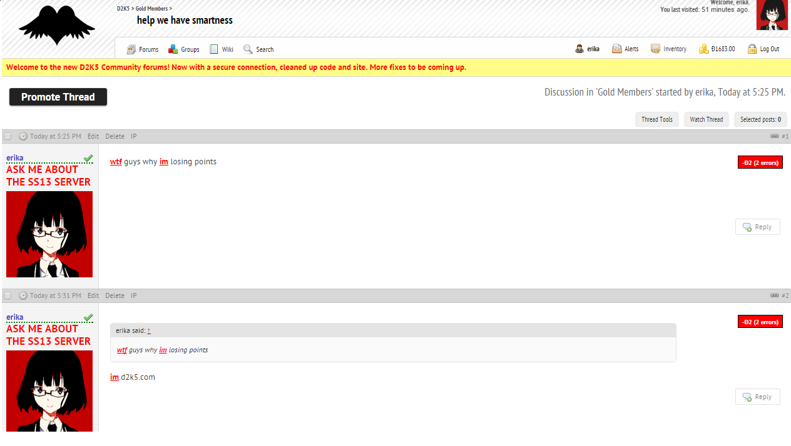
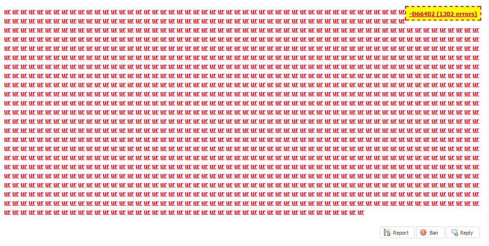
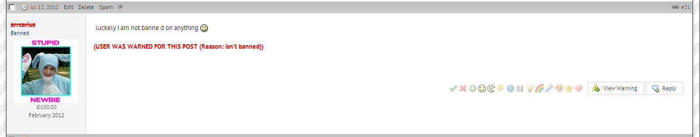

# XenForo Mods

## Shop/Market System

A simple shop system, later made modular and given an internal API to make it work with any forum or CMS software.

**Features:**

*   Ability to buy items using real money or on-site currency.
*   Users can buy on-site currency with real money.
*   Users can submit their own items.
*   Rating and flagging system for items.
*   Items have a redeem code for gifting or giveaways.
*   An inventory which displays each item you own.
*   Items can be either used, activated or downloaded depending on their type.

    

## Smartness Points

Highlights bad grammar and misspellings as red, reduces points for each mistake as a disciplinary action. Based on the FacepunchStudios smartness system from around 2004-2005.

**Features:**

*   Supports a customizable list of words, thus can be used for more than just grammar/spelling mistakes.
*   Users will lose a point for each bad word.
*   By correcting a message, the user will gain back any points lost.
*   Smartness points integrate with the bdBank currency mod for XenForo.

  

## Imageboard style warn/ban notices

Appends "**USER WAS BANNED FOR THIS POST (REASON)**" and/or  "**USER WAS WARNED FOR THIS POST (REASON)**" at the bottom of the users' post.

  

## SS13/BYOND API

**Features:**

*	XenForo user profile info fetching system.
*   Trophy (achievement) get and set system.
*   BYOND ckey comparison using XenForo custom profile fields.
*	Fetch clothing and character customization from user profile fields.
*   Shop integration.
*   bdBank integration.

# Where's the code?

*code and patch files coming soon*
